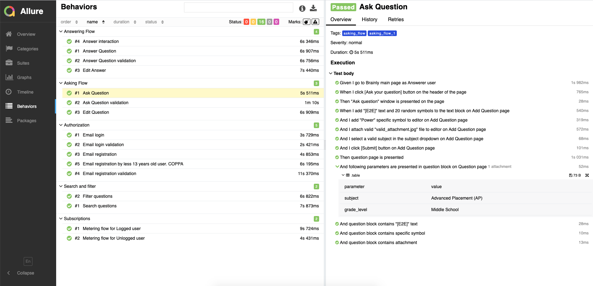

# mobile_automated_tests:
This is Mobile E2E tests BDD framework used for high-level native applications tests automation. 
Following tech stack is using:
- python
- appium
- behave
- allure
- pyhamcrest

# Setup:
1. open terminal
2. run `git clone git@github.com:mobile_automated_tests.git` to clone repository
3. run `cd mobile_automated_tests` to move to local repository folder
4. run `cp config.json.example config.json` to create config.json file
5. add actual parameters (browserstack, app authorization) for both OS's to config.json file
6. run `pipenv install` to setup all necessary dependencies from Pipfile.lock
7. run `pipenv shell` to be able use all pipenv dependencies from terminal

# Execution:
1. to run tests without report creating: 
`invoke run --os=android` (or `--os=ios` to run IOS tests)
2. to run tests with allure-report creating:
`invoke run-with-allure --os=android` (or `--os=ios` to run IOS tests)
3. to run tests with specific parameters:
`invoke run --os=android --tags=authorization` (or `--os=ios` to run IOS tests)
4. to rerun only failed tests:
`invoke run-failed --os=android` (or `--os=ios` to run IOS tests)
5. to clean up the code (static code analyser + autoformatter): 
`invoke lint`

# Docker Execution:
1. navigate to project directory
2. run `docker build -t mobile-tests . && docker run -it mobile-tests` to build and run Docker container
3. run `docker ps -f "ancestor=mobile-tests"` command to find your container ID 
4. run `docker exec -ti <container_id> sh` in another terminal
5. run `pipenv install` to setup all necessary dependencies from Pipfile.lock
6. run `pipenv shell` to be able use all pipenv dependencies from docker container
7. to run tests use command `$ invoke run-with-allure --os=android` (or `--os=ios` to run IOS tests)
